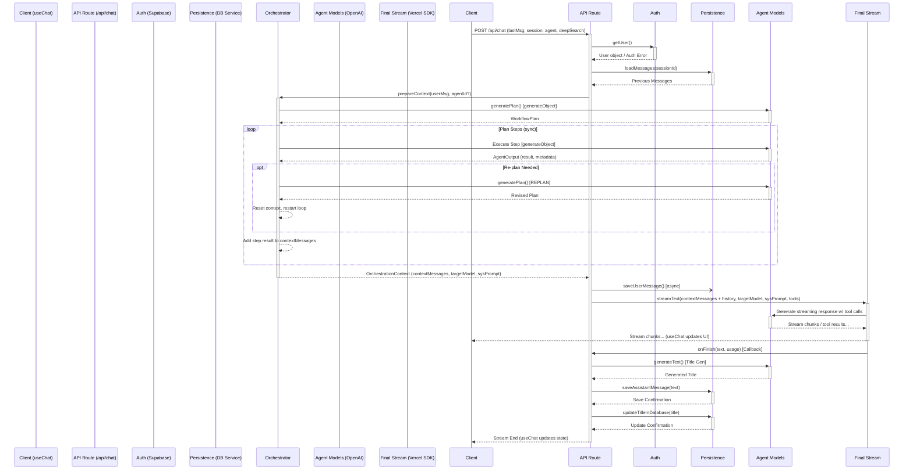

# Current Agent Orchestration Workflow (As Implemented)

**Goal:** This document describes the actual, implemented workflow for handling chat requests in the application, focusing on how agent logic, context gathering, and response generation are orchestrated. This replaces any previous outdated plans.

**Core Pattern: Hybrid Synchronous Pre-processing + Final Streaming**

The system employs a hybrid approach:

1.  **Synchronous Context Preparation:** Before the user sees any response, the backend performs potentially complex, multi-step agent actions synchronously using the `AgentOrchestrator`. This phase gathers necessary context or performs intermediate tasks using Vercel AI SDK's `generateObject`.
2.  **Final Streaming Response:** The results from the synchronous phase are injected as context messages into a final Vercel AI SDK `streamText` call, which generates the streaming response visible to the user and can utilize tools associated with the final designated agent.

**Key File Responsibilities:**

*   **`components/chat.tsx`:**
    *   Main chat UI component.
    *   Uses `@ai-sdk/react`'s `useChat` hook to manage messages, input, and API calls.
    *   Reads `selectedAgentId` and `deepSearchEnabled` from `useChatStore`.
    *   Sends requests to `/api/chat` via `useChat`, optimizing the payload using `experimental_prepareRequestBody` to include only the last message, chat ID, agent ID, and deep search status.
    *   Renders `VirtualizedChat` and `MultimodalInput`.
*   **`stores/chat-store.ts` (`useChatStore`):**
    *   Client-side Zustand store for managing conversation state (metadata index, loaded messages, current session).
    *   Persists state to `localStorage`.
    *   Handles fetching history (`fetchHistory`), loading full conversations on demand (`ensureConversationLoaded`), creating new sessions (optimistically + POST `/api/chat/session`), renaming/deleting via API calls.
*   **`hooks/chat/useChatActions.tsx`:**
    *   Manages UI state (dialogs, loading indicators) for rename/delete actions in the sidebar.
    *   Calls actions from `useChatStore` to perform the actual operations.
*   **`app/api/chat/route.ts`:**
    *   **Entry Point:** Handles POST requests for message exchange.
    *   **Auth & Validation:** Performs manual Supabase authentication and Zod request body validation (Pattern B).
    *   **Context Building:** Instantiates `MessagePersistenceService` to load history, then uses `AgentOrchestrator` to prepare context.
    *   **Orchestration:** Calls `orchestrator.prepareContext()`.
    *   **Streaming:** Calls Vercel AI SDK's `streamText` directly, providing context messages from the orchestrator, history, user message, system prompt, and tools for the *final* agent.
    *   **Persistence (Callbacks):** Saves user message (async) before streaming, saves assistant message and generates/updates title in `streamText`'s `onFinish` callback via `MessagePersistenceService` and `generateText`/`updateTitleInDatabase`.
    *   Returns the streaming response.
*   **`lib/chat-engine/services/orchestrator.service.ts` (`AgentOrchestrator`):**
    *   **Core Logic:** Orchestrates the synchronous pre-processing phase.
    *   `generatePlan`: Uses `gpt-4o-mini` (`generateObject`) to create a single or multi-step plan based on user input and agent hint.
    *   `executePlanAndGatherContext`: Executes the plan's steps synchronously. For each step, calls `generateObject` using the step's designated agent/model/prompt. Handles dependencies and potential re-planning. Collects results into `contextMessages`.
    *   `prepareContext`: Drives planning and execution, returning the `OrchestrationContext` (including `contextMessages`, `targetModelId`, `finalSystemPrompt`) needed for the final `streamText` call in the API route.
*   **`lib/chat-engine/message-persistence.ts` (`MessagePersistenceService`):**
    *   Handles all DB interactions for chat messages (`sd_chat_histories`) and session updates (`sd_chat_sessions`).
    *   Uses Supabase client (`createClient`/`createAdminClient`).
    *   Provides `saveUserMessage`, `saveAssistantMessage`, `loadMessages`. Uses RPC (`save_message_and_update_session`) with fallback to direct insert/upsert and includes retry logic. Called asynchronously by the API route.
*   **`lib/chat-engine/services/chat-context.service.ts` (`ChatContextService`):**
    *   **Responsibility:** Building the initial `ChatEngineContext` object *before* orchestration.
    *   **How it Works:** Gets current messages, `sessionId`, `userId`. Standardizes messages, extracts URLs, calls `persistenceService.loadPreviousMessages`, and returns the context object. *Note: The API route seems to call `persistenceService.loadMessages` directly, potentially making this service less critical in the current flow, although `AgentOrchestrator` might use parts of the context it prepares.*
*   **`lib/chat-engine/agent-router.ts`:**
    *   Determines agent configuration.
    *   `detectAgentType`: Uses `generateObject` (`gpt-4o-mini`) to classify user message and select agent type if not explicitly chosen.
    *   `getAgentConfig`: Provides `systemPrompt`, `temperature`, `model`, and crucially `toolOptions` for a given `AgentType`.
    *   `createAgentToolSet`: Uses the `toolOptions` from `getAgentConfig` to call `createToolSet` (from registry) and assemble the tools available for the *final `streamText` call*.
*   **`lib/chat-engine/prompts/index.ts`:**
    *   Defines `AgentType`s.
    *   Builds system prompts by combining a `BASE_PROMPT` with agent-specific instructions.
    *   Includes functions to add tool descriptions and Deep Search instructions (`buildSystemPromptWithDeepSearch`).
*   **`lib/tools/registry.tool.ts`:**
    *   Imports individual tool definitions (e.g., `knowledgeBaseTool`, `scrapeWebContentTool`, `deepSearchTool`, `profileContextTool`).
    *   `createToolSet`: Assembles a tool object (e.g., `{ getInformation: knowledgeBaseTool, deepSearch: deepSearchTool }`) based on boolean flags passed in (driven by agent config). This object is passed to `streamText`.
*   **`lib/agents/tools/*` (e.g., `website-summarizer.ts`):**
    *   These define specific, complex operations that might be better suited for the synchronous `generateObject` phase within the `AgentOrchestrator` rather than being exposed as simple tools in the final `streamText` call. They often involve multiple steps (e.g., scraping then summarizing). *Self-correction: The current structure seems to favor simpler tools defined in `lib/tools/*` being exposed to the final `streamText` call.*

**Detailed Workflow Breakdown (Enhanced):**

1.  **User Interaction (Client - `components/chat.tsx`)**
    *   User types message in `MultimodalInput`.
    *   `useChat` hook manages input state.
    *   User clicks send.

2.  **Request Initiation (Client - `components/chat.tsx`)**
    *   `handleSubmitWithSave` wrapper is called.
    *   `useChat` hook prepares the request using `experimental_prepareRequestBody`:
        *   Payload: `{ id: string (sessionId), message: Message (last user message), agentId: string (from useChatStore), deepSearchEnabled: boolean (from useChatStore) }`.
    *   `useChat` hook sends POST request to `/api/chat`.

3.  **Request Reception & Auth (Server - `app/api/chat/route.ts`)**
    *   Receives POST request.
    *   Authenticates using `createRouteHandlerClient().auth.getUser()`.
    *   Validates request body using Zod (`ChatRequestSchema`).

4.  **Initial Context & History (Server - `app/api/chat/route.ts`)**
    *   Instantiates `MessagePersistenceService`.
    *   Calls `persistenceService.loadMessages(sessionId, userId)` to get `previousMessages`.
    *   Appends the new user message (from request body) to create `currentMessages` array (`[...previousMessages, userMessage]`).

5.  **Orchestration Phase (Server - `AgentOrchestrator`)**
    *   API route instantiates `AgentOrchestrator`.
    *   API route calls `orchestrator.prepareContext(userMessageContent, agentId)`.
        *   **Planning (`generatePlan`):** `generateObject` determines `WorkflowPlan`.
        *   **Context Execution (`executePlanAndGatherContext`):**
            *   Iterates plan steps.
            *   For each step, calls `generateObject` using the step's agent config.
            *   Handles dependencies & re-planning.
            *   Collects results into `contextMessages` (array of `Message` objects).
        *   Returns `OrchestrationContext` (`{ contextMessages, targetModelId, finalSystemPrompt }`).

6.  **Final Agent & Tool Setup (Server - `app/api/chat/route.ts`)**
    *   Determines `effectiveAgentId` (request `agentId` or 'default').
    *   Calls `getAgentConfig(effectiveAgentId)` (from `agent-router`) to get the final agent's config, including `toolOptions`.
    *   Calls `buildSystemPromptWithDeepSearch(effectiveAgentId, deepSearchEnabled)` (from `prompts`) to get the final system prompt.
    *   Calls `createAgentToolSet(effectiveAgentId)` (from `agent-router`, which calls `createToolSet` from `tool-registry`) to get the tools available for the *streaming phase*.

7.  **User Message Persistence (Server - `app/api/chat/route.ts`)**
    *   Calls `persistenceService.saveUserMessage(sessionId, userMessageContent, userId, userMessageId)` asynchronously (fire-and-forget).

8.  **Streaming Phase (Server - `app/api/chat/route.ts` & Vercel AI SDK)**
    *   Calls `streamText`:
        *   `model`: `openai(targetModelId)` (from `OrchestrationContext`).
        *   `messages`: `[...contextMessages, ...currentMessages]` (Orchestrator context + history + user message).
        *   `system`: `finalSystemPrompt` (from `OrchestrationContext` if present, else from step 6).
        *   `tools`: `agentToolSet` (from step 6).
        *   Includes `onFinish` callback.
    *   AI SDK handles interactions with the LLM, including tool calls defined in `agentToolSet`.

9.  **Response Streaming (Server -> Client)**
    *   `streamText` returns a `DataStream`.
    *   API route returns `result.toDataStreamResponse()`.
    *   Client (`useChat` hook in `components/chat.tsx`) receives stream chunks and updates the `messages` state.
    *   `VirtualizedChat` displays the updating messages.

10. **Stream Completion (Server - `onFinish` Callback in `app/api/chat/route.ts`)**
    *   **Title Generation:** Calls `generateText` (`gpt-3.5-turbo`) to get a title.
    *   **Assistant Message Persistence:** Calls `persistenceService.saveAssistantMessage(sessionId, assistantResponseText, userId, toolsUsed)`.
    *   **Title Update:** Calls `updateTitleInDatabase(sessionId, title)`.

11. **Client UI Update (`components/chat.tsx`)**
    *   `useChat` hook updates `isLoading` state to `false`.
    *   Chat UI reflects the final state.

**Key Characteristics & Deviations from Old Plan:**

*   **Hybrid Model:** Combines synchronous multi-step pre-processing (`generateObject` in orchestrator) with a final streaming step (`streamText`).
*   **Synchronous Work:** Complex agent interactions happen *before* the stream starts.
*   **Context Injection:** Results from synchronous steps are injected as `assistant` role messages into the final `streamText` call's context.
*   **Final Agent Tools:** Only the tools associated with the *final* agent (determined by `agentId` or defaulting to 'default') and enabled by its `toolOptions` are available during the actual streaming generation phase.
*   **Title Generation:** Occurs synchronously in `onFinish` based solely on the initial user message.
*   **`ChatEngineFacade` & `AIStreamService`:** Appear unused/bypassed in the primary `/api/chat` flow.

**Visual Flow:**

